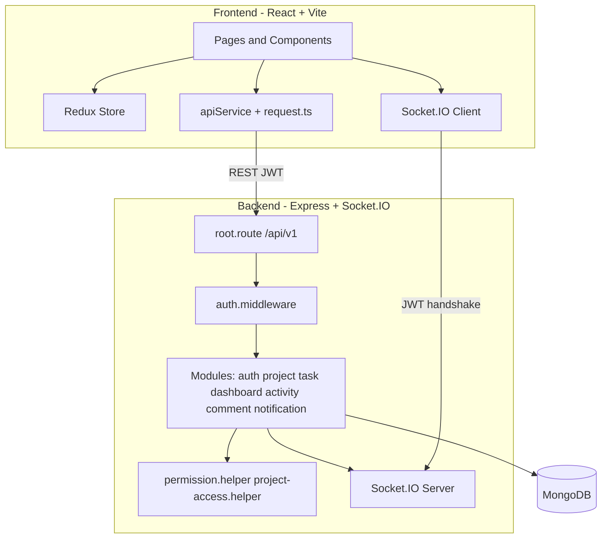
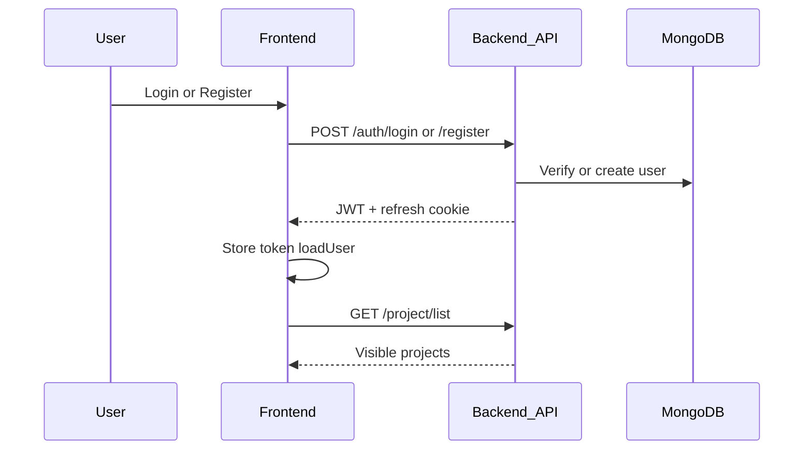
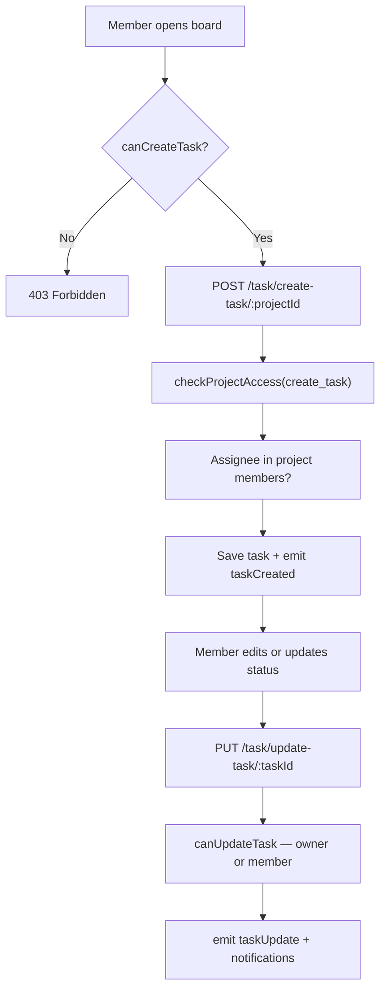
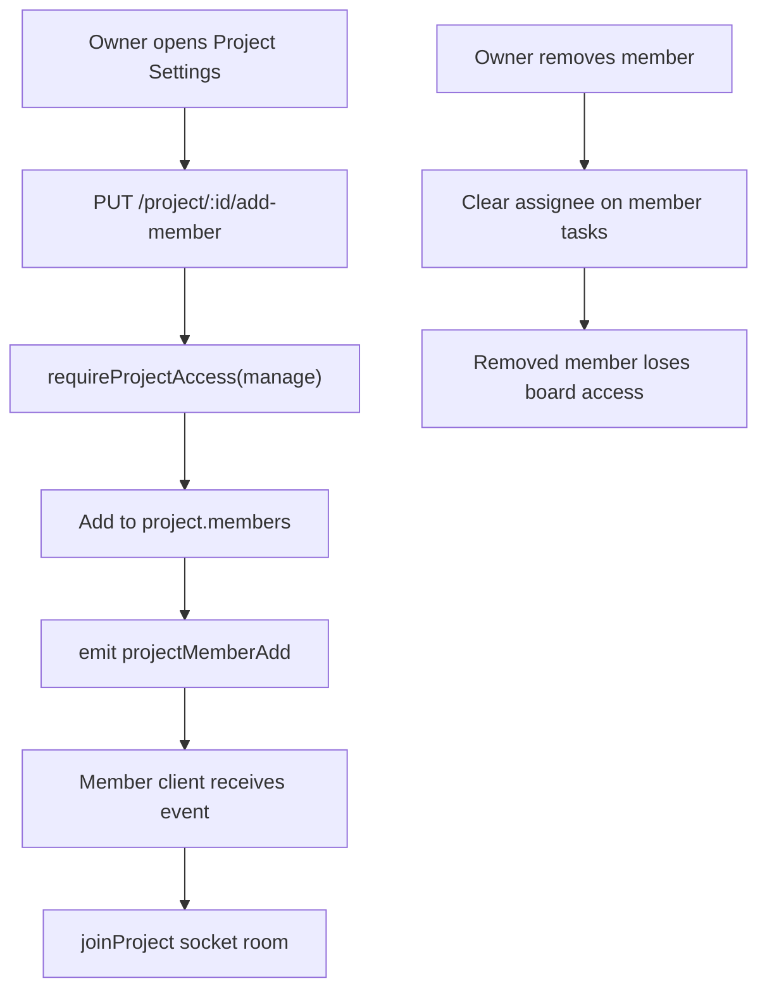

# TaskFlow Backend Service

REST API for **TaskFlow** — Smart Project & Task Collaboration System.

Companion frontend: [`../TaskFlow-frontend-service/README.md`](../TaskFlow-frontend-service/README.md)

---

## Purpose & Description

TaskFlow is a real-time Kanban project management platform for teams. The backend provides:

- JWT authentication with refresh-token cookies
- Project and membership management
- Kanban tasks with priorities, assignees, due dates, and validation rules
- Dashboard analytics scoped by project visibility
- Activity audit log, flat task comments, and persisted notifications
- Real-time updates via Socket.IO

### Tech Stack

| Layer      | Technology                                 |
| ---------- | ------------------------------------------ |
| Runtime    | Node.js >= 20                              |
| Language   | TypeScript                                 |
| Framework  | Express 4                                  |
| Database   | MongoDB (Mongoose 8)                       |
| Auth       | JWT + bcrypt + HTTP-only refresh cookies   |
| Validation | Zod                                        |
| Real-time  | Socket.IO 4                                |
| Testing    | Jest (scaffold present; no test files yet) |

---

## Role Model

TaskFlow uses **two layers** of roles. They are not interchangeable.

### Global roles (stored on User / JWT)

| Role    | Description                                                                  |
| ------- | ---------------------------------------------------------------------------- |
| `ADMIN` | System administrator. Bypasses all project-level permission checks.          |
| `USER`  | Default role for registered users. Permissions depend on project membership. |

Defined in `src/modules/auth/types/auth.types.ts`.

### Project roles (computed at runtime)

| Role     | How it is determined                |
| -------- | ----------------------------------- |
| `OWNER`  | User matches `project.owner`        |
| `MEMBER` | User appears in `project.members[]` |

There is **no per-member role field** in the database (no viewer/editor enum). Owners are automatically added to `members` on project creation.

### Demo accounts

Demo users are seeded for testing. They map to **behavior**, not separate code roles:

| Account              | Global role | Typical project role |
| -------------------- | ----------- | -------------------- |
| `admin@taskflow.com` | `ADMIN`     | Bypasses all checks  |

---

## Permissions (API Enforcement)

Source of truth: `src/helpers/permission.helper.ts`, `src/helpers/project-access.helper.ts`, and service-layer checks.

| Feature / Action                           |    ADMIN    |         OWNER         |     MEMBER      | Non-member |
| ------------------------------------------ | :---------: | :-------------------: | :-------------: | :--------: |
| View visible projects                      |     All     | Own + member projects | Member projects |     No     |
| Create project                             |     Yes     |          Yes          |       Yes       |     No     |
| Update / delete project                    |     Yes     |          Yes          |       No        |     No     |
| Add / remove members                       |     Yes     |          Yes          |       No        |     No     |
| View tasks (`POST /task/task-list`)        |     Yes     |          Yes          |       Yes       |     No     |
| Create task                                |     Yes     |          Yes          |       Yes       |     No     |
| Update task (all fields, assign/unassign)  |     Yes     |          Yes          |       Yes       |     No     |
| Delete task                                |     Yes     |          Yes          |       No        |     No     |
| Assign via `PUT /task/assign-task`         |     Yes     |          Yes          |       Yes       |     No     |
| View dashboard / activity                  | System-wide |    Project-scoped     | Project-scoped  |     No     |
| Create / list comments                     |     Yes     |          Yes          |       Yes       |     No     |
| Delete comment                             |     Yes     |    Author or owner    |   Author only   |     No     |
| List / mark own notifications              |     Yes     |          Yes          |       Yes       |     No     |
| List all users (`GET /auth/get-all-users`) |     Yes     |          No           |       No        |     No     |
| Socket.IO `joinProject`                    |     Yes     |          Yes          |       Yes       |     No     |

### `checkProjectAccess` action matrix

| Action                                              | Owner | Member |
| --------------------------------------------------- | :---: | :----: |
| `manage`, `delete_task`                             |  Yes  |   No   |
| `create_task`, `assign_task`, `view`, `update_task` |  Yes  |  Yes   |

### Business rules

- **Assignee validation:** On create/update, assignee must be the project owner or in `project.members` (`task.service.ts`).
- **Completed tasks:** Cannot be reassigned to a different user (`task-validation.helper.ts`). Unassigning is allowed.
- **Duplicate titles:** Task titles must be unique within a project.
- **Due dates:** Cannot be set in the past.
- **Member removal:** Clears that member as assignee on all tasks in the project.
- **Notifications:** Users can only mark their own notifications as read.

### Permission helpers

| Helper               | Location                   | Purpose                           |
| -------------------- | -------------------------- | --------------------------------- |
| `isAdmin`            | `permission.helper.ts`     | Global admin check                |
| `isProjectOwner`     | `permission.helper.ts`     | Owner check                       |
| `isProjectMember`    | `permission.helper.ts`     | Member list check                 |
| `checkProjectAccess` | `permission.helper.ts`     | Route middleware action checks    |
| `canUpdateTask`      | `permission.helper.ts`     | Owner or member of task's project |
| `canDeleteTask`      | `permission.helper.ts`     | Admin or project owner only       |
| `canAccessProject`   | `project-access.helper.ts` | View/join project                 |
| `getVisibleProjects` | `project-access.helper.ts` | Scope queries for non-admins      |

---

## System Architecture



### Request flow

1. Client sends `Authorization: Bearer <token>` on REST calls.
2. `authenticateJWT` middleware validates the token and sets `req.user`.
3. Route-level middleware (`requireProjectAccess`, `requireGlobalRole`) or service-layer checks enforce permissions.
4. Socket.IO connections authenticate via `socket.handshake.auth.token`; `joinProject` and `joinUser` are permission-checked.

---

## Activity Diagrams (Core Features)

### Authentication and session



### Task lifecycle (create, assign, update status)



### Project membership and real-time sync



---

## File Structure

```
TaskFlow-backend-service/
├── src/
│   ├── server.ts              # Express + Socket.IO entry
│   ├── root.route.ts          # Mounts all module routers under /api/v1
│   ├── config/
│   │   └── db.config.ts
│   ├── handlers/
│   │   ├── async.handler.ts
│   │   ├── error.handler.ts
│   │   └── response.handler.ts
│   ├── helpers/
│   │   ├── permission.helper.ts       # RBAC core
│   │   ├── project-access.helper.ts   # Visibility scoping
│   │   ├── task-validation.helper.ts
│   │   ├── activity.helper.ts
│   │   ├── notification-recipients.helper.ts
│   │   ├── membership-events.helper.ts
│   │   ├── socket-auth.helper.ts
│   │   └── auth.helper.ts
│   ├── middlewares/
│   │   ├── auth.middleware.ts         # JWT + project access guards
│   │   ├── validate.middleware.ts
│   │   └── error.middleware.ts
│   ├── types/
│   ├── utils/
│   ├── tests/
│   │   ├── setup/
│   │   └── utils/
│   └── modules/
│       ├── auth/          # Login, register, JWT, user listing
│       │   ├── controllers/
│       │   ├── services/
│       │   ├── routes/
│       │   ├── models/
│       │   ├── validators/
│       │   └── types/
│       ├── project/       # CRUD, membership
│       ├── task/          # Kanban tasks
│       ├── dashboard/     # Analytics
│       ├── activity/      # Audit feed
│       ├── comment/       # Task comments
│       └── notification/  # User notifications
├── scripts/
│   └── seed.ts            # Promote admin + seed demo users
├── package.json
├── tsconfig.json
├── jest.config.json
├── vercel.json
└── .env.example
```

Each module follows: `controllers/`, `services/`, `routes/`, `models/`, `validators/`, `types/`.

---

## API Routes

Base URL: `http://localhost:5000/api/v1`

### Auth — `/auth`

| Method | Path                | Auth        | Description                |
| ------ | ------------------- | ----------- | -------------------------- |
| POST   | `/login`            | Public      | Login; sets refresh cookie |
| POST   | `/register`         | Public      | Sign up                    |
| POST   | `/refreshToken`     | Cookie      | Refresh access token       |
| GET    | `/get-all-users`    | JWT + ADMIN | List all users             |
| GET    | `/users-for-invite` | JWT         | Users for project invites  |

### Project — `/project`

| Method | Path                     | Auth         | Description                           |
| ------ | ------------------------ | ------------ | ------------------------------------- |
| POST   | `/create`                | JWT          | Create project (caller becomes owner) |
| GET    | `/list`                  | JWT          | List visible projects                 |
| PUT    | `/update/:projectId`     | JWT + manage | Update project                        |
| PUT    | `/:projectId/add-member` | JWT + manage | Add member                            |
| PUT    | `/remove-member`         | JWT + manage | Remove member                         |
| DELETE | `/delete-project`        | JWT + manage | Delete project                        |

### Task — `/task`

| Method | Path                      | Auth                | Description                  |
| ------ | ------------------------- | ------------------- | ---------------------------- |
| POST   | `/task-list`              | JWT + view          | Filtered/paginated task list |
| POST   | `/create-task/:projectId` | JWT + create_task   | Create task                  |
| PUT    | `/assign-task`            | JWT + assign_task   | Assign task                  |
| PUT    | `/update-task/:taskId`    | JWT + canUpdateTask | Update task                  |
| DELETE | `/delete-task`            | JWT + canDeleteTask | Delete task                  |

### Dashboard — `/dashboard`

| Method | Path                  | Description            |
| ------ | --------------------- | ---------------------- |
| GET    | `/stats`              | KPI counts             |
| GET    | `/project-summaries`  | Per-project summaries  |
| GET    | `/workload`           | Assignee workload      |
| GET    | `/upcoming-deadlines` | Tasks due soon         |
| GET    | `/high-priority`      | High-priority tasks    |
| GET    | `/charts`             | Chart aggregation data |

### Activity — `/activity`

| Method | Path      | Description          |
| ------ | --------- | -------------------- |
| GET    | `/recent` | Recent activity feed |

### Comment — `/comment`

| Method | Path          | Description    |
| ------ | ------------- | -------------- |
| POST   | `/:taskId`    | Add comment    |
| GET    | `/:taskId`    | List comments  |
| DELETE | `/:commentId` | Delete comment |

### Notification — `/notification`

| Method | Path        | Description                       |
| ------ | ----------- | --------------------------------- |
| GET    | `/`         | List current user's notifications |
| PUT    | `/:id/read` | Mark notification read            |

### Socket.IO events

**Server → client:** `taskCreated`, `taskUpdate`, `taskDelete`, `taskAssign`, `commentAdded`, `commentDeleted`, `projectUpdated`, `projectDeleted`, `projectMemberAdd`, `projectMemberRemove`, `memberAssigneesCleared`, `notification`

**Client → server:** `joinProject(projectId)`, `joinUser(userId)` (both permission-checked)

---

## Setup

```bash
cd TaskFlow-backend-service
pnpm install
cp .env.example .env
# Set MONGODB_URI and JWT_SECRET
pnpm run seed      # Promotes admin@taskflow.com to ADMIN
pnpm run start:dev
```

Server runs at `http://localhost:5000/api/v1`.

### Environment variables

| Variable          | Required            | Description                                              |
| ----------------- | ------------------- | -------------------------------------------------------- |
| `PORT`            | No (default `5000`) | HTTP port                                                |
| `MONGODB_URI`     | Yes                 | MongoDB connection string                                |
| `JWT_SECRET`      | Yes                 | JWT signing secret                                       |
| `CLIENT_ECOM_URL` | Prod                | Frontend origin for CORS (e.g. `http://localhost:3000`)  |
| `NODE_ENV`        | No                  | `development` or `production`                            |
| `ADMIN_EMAIL`     | Seed                | Email to promote to ADMIN (default `admin@taskflow.com`) |

### Demo credentials

| Account              | Email               | Password   |
| -------------------- | ------------------- | ---------- |
| Admin                | admin@taskflow.com  | Admin@123  |
| Project owner (demo) | pm@taskflow.com     | Pm@123     |
| Team member (demo)   | member@taskflow.com | Member@123 |

### Scripts

| Command              | Description                        |
| -------------------- | ---------------------------------- |
| `pnpm run start:dev` | Dev server with nodemon            |
| `pnpm run build`     | Compile TypeScript                 |
| `pnpm start`         | Production (`node dist/server.js`) |
| `pnpm test`          | Run Jest                           |
| `pnpm run seed`      | Seed admin user                    |

---

## Deployment

```bash
pnpm run build
pnpm start
```

Vercel deployment is configured via `vercel.json` (entry: `dist/server.js`).

---

## Future Features (Roadmap)

Planned improvements not yet implemented:

- Granular project roles (viewer / editor) stored in schema
- Email and push notifications beyond in-app Socket.IO
- Task attachments and rich-text descriptions
- Subtasks, labels, and task dependencies
- OAuth / SSO login
- Full automated test coverage
- `@mentions` in comments
- Project templates and recurring tasks
- Audit log export and advanced reporting

---

## Related

- Frontend client: [`../TaskFlow-frontend-service`](../TaskFlow-frontend-service)
